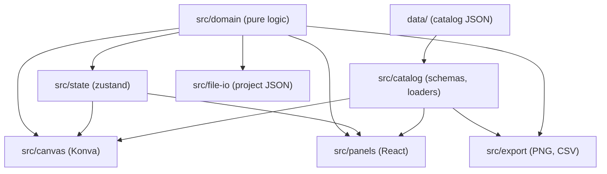

# System Architecture

> On conflict, `CLAUDE.md` and the code win. This document summarizes and cross-references that binding rule file rather than repeating it in full.

## System Overview

Security Layout Planner is a browser-only floor-plan security camera and alarm planner: load a PNG or JPEG floor plan, calibrate scale, place cameras / sensors / alarm devices and hubs, draw cable routes, generate a bill of materials and export a PNG with BOM strip or CSV. No backend, no runtime network calls. Built with Vite + React 19 + TypeScript + Konva (canvas) + zustand (state, undo via zundo) + Tailwind 4 + Zod (validation).

## Architecture Layers



Arrows point from a layer to the layers that import it (main edges only - `canvas`, `panels`,
`export` and `file-io` also import each other and `state`). `src/domain` imports no React, Konva or
`src/catalog` (a catalog lookup is passed in as an argument); only `src/catalog` loaders read `data/`.

```
data/                             ← Catalog JSON files (camera, sensor, fire-alarm records)
  └─ <brand>/<device-type>/*.json   (camera-*, sensor-*, fire-alarm-*)

src/catalog/                      ← Loaders and schemas for catalog data (read-only)
  ├─ camera/ sensor/ fire-alarm/ ← `*-catalog-schema.ts` (Zod) + `*-catalog-loader.ts` (glob)
  └─ shared/                      ← Price / provenance schema, data-file ordering

src/domain/                       ← Pure logic layer (no React, no Konva, no catalog imports)
  ├─ <feature>/...               ← Functions for each domain (cable, floor, camera, etc.)
  └─ shared/                      ← Domain utilities

src/state/                        ← Zustand stores (no subfolders)
  ├─ project-store.ts            ← Project store (zundo `temporal`)
  ├─ project-store-*-actions.ts  ← Action slices
  ├─ project-store-active-floor-update.ts ← Write helpers (`patchActiveFloor` / `patchFloorById`)
  └─ project-store-floor-selectors.ts ← Read selectors

src/canvas/                       ← Konva drawing components (5 layers only)
  ├─ stage/                       ← Stage, layer composition, pan / zoom
  ├─ <feature>/...               ← Feature-specific Konva components
  └─ shared/                      ← Shared utilities

src/panels/                       ← React UI panels (toolbar, sidebar, properties, BOM)
  ├─ <feature>/...               ← Feature-specific panels
  └─ shared/                      ← Shared components

src/export/                       ← PNG and CSV export
  ├─ png/                         ← PNG canvas composition
  ├─ csv/                         ← The two CSV downloads
  └─ shared/                      ← Combined BOM rows, file names, export actions hook

src/file-io/                      ← Project file load / save, image loading
  ├─ browser/                     ← File download, image read / decode
  └─ project-file/               ← Save / load plumbing (the schema is in src/domain/project-file)

Never: `domain/` imports React, Konva, or `catalog/`.
```

## Data Model

**Project** (`src/domain/project-file/project-types.ts`): the root, holding ordered `floors[]` (1–20) + project-level `shafts`, `cableTypes`, `cableSettings`, `fireAlarmSettings`.

**Floor** (`src/domain/floor/floor-types.ts`): `id`, `name`, plan `image` (nullable), `scale` (nullable; holds `planPxPerMeter`), and placed items:
- `cameras[]` — `{ id, modelId, x, y, rotationDeg, rangeM, hfovDeg?, mountHeightM?, tiltDeg? }`
- `sensors[]` — one of three shapes: `sector` (`rotationDeg`, `rangeM`, `angleDeg?`), `circle` (`radiusM`), `beam` (second end `x2`, `y2` + `environment`)
- `fireAlarmDevices[]` — `{ id, modelId, x, y }`
- `walls[]` — opaque or glass segments in image px
- `hubs[]` — hub / riser / drop / shaft markers (cable endpoints)
- `cables[]` — cable routes from a device to a hub or another device
- `floorHeightM` — floor-to-floor height to the floor above (default 3.5 m)

**Cable** (`src/domain/cable/cable-layout-types.ts`): `{ id, device, hubId? | endDevice?, typeId, points, beyondShaft? }`
- `device`: the start device ref `{ kind, id, end? }` (camera, sensor, fire-alarm) - never a hub
- `hubId` | `endDevice`: exactly one of hub or device endpoint
- `points[]`: intermediate route vertices in image px
- `beyondShaft`: per-cable route beyond a shaft opening (on exit floor)

**Hub kinds**: `kind` omitted = plain hub; `'riser'` (rises to floor above), `'drop'` (descends), `'shaft'` (one opening of a project shaft, with `shaftId`).

**Derived, never stored**:
- Item labels: `C1`, `S1`, `H2`, `P1` (per floor, per shared prefix; source: `buildFloorItemLabels`)
- Cable labels: `F1_C3_F2_H1` (end-to-end format; source: `buildProjectCableEndToEndLabels`)
- Cable endpoints: computed from live device / hub position
- Cable lengths: computed by the estimate (metres never persisted)
- Detector coverage circles: computed at draw time, never stored
- Wall occlusion polygons: computed at draw time, applied as a Konva clip

## Units and Coordinates

- **Image coordinates**: positions and route points are image pixels (x right, y down). Rotation is degrees, 0 = +x axis, clockwise.
- **Metres**: scale is set per floor (`scale.planPxPerMeter`), used for coverage sizes and cable length estimates. Wall math stays in image px; metres are converted only at the canvas edge.
- **DORI px/m** (EN 62676-4 pixel density, `DORI_PX_PER_METER`): separate from `planPxPerMeter`; never mixed.
- **Mount heights**: a camera's `mountHeightM` + `tiltDeg` are optional and both-or-neither (unset = flat cone). Sensors and fire-alarm devices have no mounting height. For cable maths a device without one uses `cableSettings.defaultDeviceHeightM` (default 3 m).
- **Tilt**: degrees downward from horizontal (mounted camera only); fisheye (HFOV ≥ 180°) ignores tilt.

## Project State

**Store shape** (`ProjectState` in `src/state/project-store-state-and-action-types.ts`, store created in `project-store.ts`):
```
{
  floors[]           ← Floor objects, ordered by position in tab bar
  activeFloorId      ← Current tab, untracked (not an undo step)
  shafts[]           ← Project-level shafts { id, name }
  cableTypes[]       ← Cable types with limit + price
  cableSettings { wastePercent, routeHeightM, defaultDeviceHeightM, deviceEndSlackM, hubEndSlackM, clickErrorPx }
  fireAlarmSettings { coverageMode, ceilingHeightM }
  loadSeq            ← Bumped by replaceProject / resetProject only (view-reset signal, untracked)
}
```

**Read access**: `src/state/project-store-floor-selectors.ts` (never use a selector that returns a fresh object / array as a hook selector).

**Write access**: store actions; floor content is patched through `patchActiveFloor()` / `patchFloorById()` (`project-store-active-floor-update.ts`), which also run the cross-floor + shaft prune in the same `set()`.

**Undo / redo**: zundo `temporal` in `project-store.ts` tracks `floors`, `shafts`, `cableTypes`, `cableSettings`, `fireAlarmSettings` (limit 100 steps); `undoProject` / `redoProject` (`project-store-undo-redo.ts`) switch to the floor the step changed. Only `replaceProject` / `resetProject` clear history.

**Floor switch**: clears selection + tool, remounts stage (keyed by floor id + project-load epoch); the view config is kept.

**UI-only stores** (never persisted, never in undo):
- `editor-ui-store.ts`: tool mode, viewport, selection, `viewConfig` (one flag per view toggle), `decodedImage`, notifications, `hasUnsavedChanges`, `projectLoadEpoch`
- `catalog-sidebar-filter-store.ts`: active catalog tab + brand / kind / controller filters

## Canvas: Five Konva Layers

Bottom to top (`plan-scene-layers.tsx` composes the first four; the PNG export mounts the same component):

1. **Image Layer** (`plan-scene-layers.tsx`): the plan image.
2. **Cones Layer** (`plan-scene-coverage-layer.tsx`): camera FOV cones (banded), sensor coverage, fire-detector coverage circles; non-listening.
3. **Walls Layer** (`src/canvas/wall/wall-segments-layer.tsx`): wall lines, then the children slot (trunk lines, shaft legs, cable lines, cable labels), then wall node handles.
4. **Markers Layer** (`plan-scene-markers-layer.tsx`): the selected cable / trunk vertex editor (drag a vertex, double-click to add / remove), camera / sensor / fire-alarm markers with their short labels (`C1`, `H2`), hub / riser / drop / shaft markers.
5. **Editor Overlay Layer** (`plan-editor-overlays-layer.tsx`): scale calibration, wall drawing, hub placement, cable drawing and trunk drawing overlays.

No new Konva Layers for any feature. Marker icons are capped on screen (`MARKER_ICON_MAX_SCREEN_RADIUS_PX` = 12, `resolveMarkerZoomCapScale`). Cable labels are drawn with the cable lines (walls Layer children), image-px font scaled by `resolveMarkerZoomCapScale` in the editor (PNG keeps image px).

## Labels

**Item labels** per floor, per PREFIX (S = sensor + smoke, H = hub + heat, R = riser + relay, E = expander + call point, C = camera, P = panel, etc.):
- Order within each shared prefix: cameras, fire-alarm devices, sensors, hubs (array order). A shaft marker's `T{n}` comes from the project's `shafts[]` order.
- Source: `buildFloorItemLabels` (`src/domain/floor/floor-item-label-allocator.ts`) — the one label source for canvas, panels, BOM, PNG, CSV, cable labels.
- Canvas and properties text stay short (`C1`, `H2`); BOM rows and cable labels always carry floor prefix (`F1_C1`, `F1_C1_F1_H1`).

**Cable end-to-end label** `F{n}_device_F{m}_final_end` (both floors always shown, one-floor projects included):
- Format: `F1_C3_F2_H1` (floor 1 camera 3 → floor 2 hub 1), `F1_C1_?` (unresolved end).
- Source: `buildProjectCableEndToEndLabels` (`src/domain/cable/cable-end-to-end-label.ts`) — the one label source for panels, canvas, PNG, BOM, CSV, warnings.
- Riser / drop / shaft points never appear (pass-through); label follows chains to final end.
- Not unique: multiple cables may share one label (code keys on `cableId`).

## Cable Subsystem

**Endpoint index** (`src/domain/cable/cable-endpoint-index.ts`, `buildCableEndpointIndex`): one floor's device ends and hub ends with their live position, label and height; `resolveCableEnd` / `resolveCablePathPx` resolve a cable's refs against it.

**Cross-floor route walker** (`src/domain/cable/cross-floor-route-walker.ts`, `walkCrossFloorRoute`):
- The one topology walk (no metres); `cross-floor-hub-beyond-length-resolver.ts` folds metres over it and `cable-end-to-end-label.ts` reads its final end.
- Hops: `shaft-leg` (`resolveShaftLeg`, `shaft-cable-leg.ts`; only for the cable's own first hub) and `pair` (`resolveCrossFloorExit`, `cross-floor-exit-resolver.ts`).
- Ends on hub, device, cycle, broken, or missing.

**Shaft cable leg** (`src/domain/cable/shaft-cable-leg.ts`):
- Per-cable route beyond a shaft opening (`Cable.beyondShaft`, on exit floor).
- Not routed = `?` label, counted to opening (typed `extraLengthM` only, no vertical).
- Routed = labelled by its end (hub or device), vertical = sum of `floorHeightM` + leg at exit floor's scale.

**Cable length estimate** (`src/domain/cable/cable-length-estimate-calculator.ts`, `estimateCableLength`):
- Per-cable: horizontal (route / scale) + vertical runs (route height vs device / end height) + length beyond the end + slack at both ends = `run`; `purchase` = run + spare allowance.
- `cable-layout-estimate.ts` (`computeCableLayoutEstimate`) is the per-floor building block; `project-cable-layout-estimate.ts` (`computeProjectCableEstimate`) is the one entry point (panels, canvas, BOM, PNG, CSV), cached by a single-slot reference memo.

**Unestimated cables**: floor without a scale, route crossing a scale-less floor, or a cycle. Listed with reason, no length guessed.

## Three Catalogs

**Camera** (`src/catalog/camera/`): 106 records (Hikvision, Dahua, Axis).
- Specs (resolution, lens, HFOV, illumination, DORI): copied from official datasheet, never calculated.
- Price source: Vietnamese reseller displayed price (or null). Stored per record with `priceVn`, `purchaseLinks` (primary + secondary shop).
- File structure: `data/<brand>/camera-<formFactor>/<brand>-camera-<formFactor>_<NN>.json` (bullet, dome, turret, ptz, fisheye).

**Sensor** (`src/catalog/sensor/`): 31 records (Hikvision, Dahua, Bosch, Takex); IDs disjoint from camera.
- Kinds: PIR, IR beam, vibration / glass-break, thermal.
- Specs: range, angle, thermal bands (detection / recognition / identification). Datasheet only; a feet-only value is stored as ft × 0.3048 rounded to 0.1 m with `convertedFromFeet: true`.
- Price: Vietnamese reseller or null.
- File structure: `data/<brand>/sensor-<kind>/<brand>-sensor-<kind>_<NN>.json`.

**Fire alarm** (`src/catalog/fire-alarm/`): 62 records (Hikvision, AoLin); IDs disjoint from camera and sensor.
- Brands: Hikvision (AX HYBRID PRO, AX PRO lines) + AoLin (conventional wired).
- Kinds: 19 types (control panel, hubs, modules, detectors, sounders, contacts, etc.; see `FIRE_ALARM_KIND_CATALOG_TAB`).
- Specs: from official Hikvision datasheet or manual, copied as printed. Magnetic contact, environment detector and intrusion detector are marker-only kinds.
- Compatibility: stored only on controller records (`compatibleDevices[]`); sourced from Hikvision's official lists or owner decision (2026-10-08: nhaantoan wired devices).
- Price: Vietnamese price or null. A device with no official source is stored with `sourceUrl: null` - model, kind and price only.
- File structure: `data/<brand>/fire-alarm-<kind>/<brand>-fire-alarm-<kind>_<NN>.json`.

Loaders glob `data/*/camera-*/*.json`, `data/*/sensor-*/*.json`, `data/*/fire-alarm-*/*.json`. Add new records or brand / type folders without loader edits.

## Export

**BOM** (groupers in `src/domain/bom/`, assembled by `buildCombinedBomRows` in `src/export/shared/build-combined-bom-rows.ts`): one list for whole project or one floor.
- Rows: camera (grouped by brand + model + lens), sensor (kind + brand + model), fire-alarm (kind + brand + model), cabling points (hub / riser / drop / shaft opening, unit `pcs`), cable (one per type, unit `m`).
- Cabling points carry `priceTbd: true` (cells print `TBD`), excluded from totals + unpriced count.
- Labels: always floor-prefixed `F{n}_` (one-floor projects too). Canvas text short (`C1`).
- Cable metres: summed per type, rounded up to whole metres once on the total; per-cable lengths include spare % (default 15%, live `cableSettings.wastePercent`) and so do not sum exactly to the BOM total.

**PNG** (`src/export/png/`): plan at image resolution with legend + BOM strip (downscaled when the canvas would exceed 16,777,216 px or 16,384 px on a side).
- Draws: plan, coverage, walls, hubs, cable lines + labels, device markers, legend + BOM table.
- Names: `<image stem>-device-layout.png` (renamed from `-camera-layout.png`); multi-floor: `F{n}-<floor name>-<image name>-device-layout.png` (`buildFloorExportFileName`).
- View: follows on-screen config (hidden items noted in strip); fire-alarm always drawn.

**CSV** (`src/export/csv/`): two files, always whole project.
- `<stem>-bom.csv`: 12 columns (Type, Brand, Model, Form Factor, Resolution, Lens, Quantity, Unit, Labels, Unit Price (VND), Total (VND), Notes); fire-alarm compatibility warnings in Notes; cabling points show `TBD` in both price cells.
- `<stem>-cable_length_estimate.csv` (when project has cable): Cable, Type, Length (+N% spare) (m), Notes; one row per cable (`buildProjectCableListRows`); lengths from `computeProjectCableEstimate` (`purchase`).

**Project file** (schema in `src/domain/project-file/project-file-schema.ts`: `parseProjectFile` / `serializeProject`; save / load in `src/file-io/project-file/`): JSON, schema v9 (reads v1–9).
- Save: always v9.
- Load: v7–9 share one `floors[]` schema; v1–6 wrapped as one-floor project; pre-v9 shared shaft exits migrated to per-cable routes; bad cross-floor data (invalid links, routes, markers) dropped with warning (never rejected).
- File name: `-device-layout.json` (renamed from `-camera-layout.json`); `app` id inside file stays `camera-layout-tool`; old files still open (loader reads content, not filename).
- Size: the file text is capped at 80 MB on load and before save; `floor-image-budget.ts` warns / refuses when adding a plan image would approach that. Plan images are stored inside the file (replaced / deleted images stay in memory while undo can reach them).

---

(See `CLAUDE.md` for complete coverage rules, cable label format, BOM row detail, schema migration, compatibility lists, fire-detector coverage modes, wall blocking rules, and view config.)
